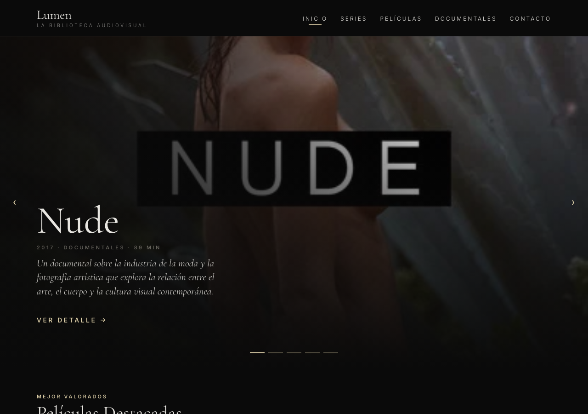
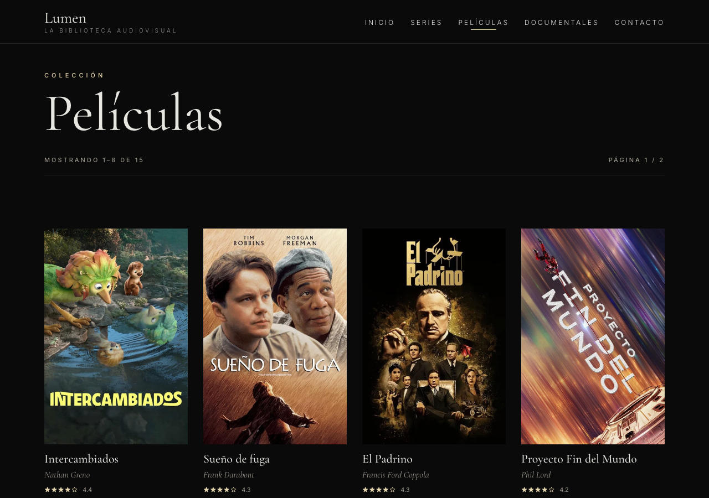
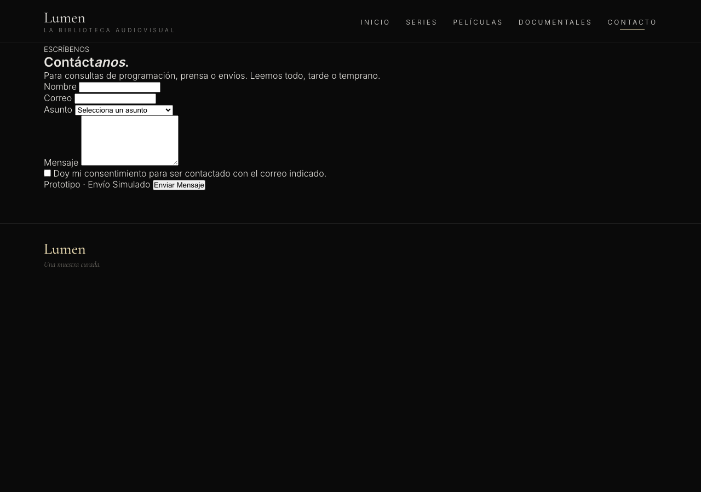

# Lumen

**Lumen** es un sitio web estático y multipágina para una biblioteca audiovisual curada (películas, series y documentales). Proyecto académico del curso *Entornos Web* (Cibertec). Todo el contenido está en español.

## Pantallas

| Inicio | Listado |
|---|---|
|  |  |

| Detalle | Contacto |
|---|---|
|  |  |

## Stack

- **HTML5** — cada página es un documento completo e independiente (no es una SPA).
- **CSS puro** — sin frameworks. Tema oscuro, mobile-first, tokens de diseño con variables CSS (`--lumen-*`).
- **Vanilla JS** — sin librerías ni gestor de paquetes.
- **Google Fonts** — cargadas desde CDN.

Sin build, sin bundler, sin dependencias que instalar.

## Cómo correrlo localmente

El JS de las páginas usa rutas relativas, así que conviene servir el sitio con un servidor local en lugar de abrir los archivos directamente:

```bash
python3 -m http.server 8000
```

Luego visita [http://localhost:8000](http://localhost:8000). El `index.html` redirige automáticamente a `inicio/inicio.html`.

## Estructura de archivos

```
proyecto/
├── index.html            # Redirige a inicio/inicio.html
├── base.css              # Tokens de diseño + chrome compartido (nav, footer)
├── README.md
├── shared/
│   ├── data.js           # CONTENT (≈42 items) + helper global Data
│   ├── helpers.js        # Utilidades compartidas
│   └── ui.js             # Helpers de render compartidos
├── inicio/               # Home (hero + tiras destacadas)
│   ├── inicio.html
│   ├── inicio.css
│   └── inicio.js
├── listado/              # Catálogo, una página por categoría
│   ├── peliculas.html
│   ├── series.html
│   ├── documentales.html
│   ├── listado.css
│   └── paginacion.js
├── detalles/             # Detalle de un título
│   ├── detalles.html
│   ├── detalles.css
│   └── detalles.js
└── contacto/             # Formulario de contacto
    ├── contacto.html
    ├── contacto.css
    └── contacto.js
```

`shared/data.js` es la única fuente de datos (≈42 items, sin backend ni `fetch`). Define `CONTENT` y un objeto `Data` con helpers como `all()`, `byId(id)`, `byType(type)`, `featured(type, n)` y `paginate(items, page, perPage)`.

**Orden de carga de scripts** — cada página carga, en este orden exacto: `shared/data.js` → `shared/helpers.js` → `shared/ui.js` → script de la página. Los globales definidos por los primeros scripts los usan los siguientes; respeta este orden al editar páginas.

## Diseño

El diseño de referencia está en Figma: [Lumen — Film Library](https://www.figma.com/design/KFYFKMgp7gYXUTNt0T1ZPy).
